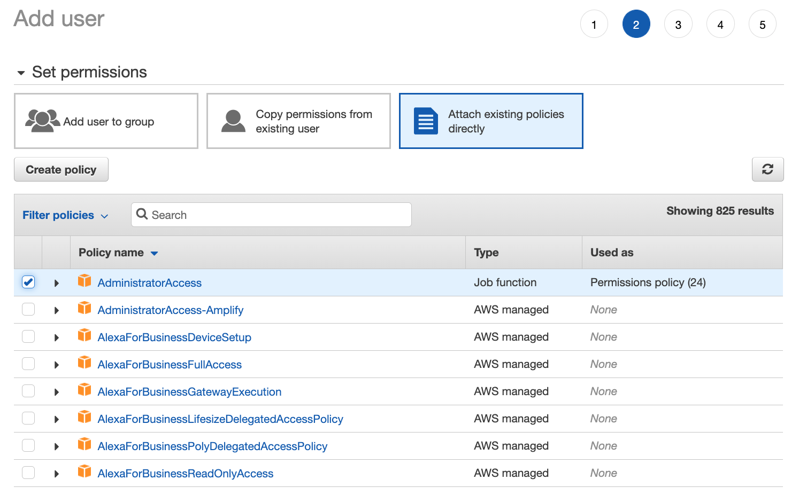

## Build an Authenticated GraphQL API on AWS with CDK

In this workshop you'll learn how to build and deploy an authenticated GraphQL API on AWS with Amazon Cognito, AWS AppSync, AWS Lambda, and Amazon DynamoDB.

The API will implement a combination of private and public access to build out a basic Product API for an E Commerce back end.

The API will also be implementing group authorization, enabling only users of an "Admin" group to be able to perform create, update, or delete mutations and everyone to be able to query for products by ID, a list of products, or products by category by utilizing a DynamoDB GSI (Global Secondary Index).

### Overview

When you think of many types of applications like Instagram, Twitter, or Facebook, they consist of a combination of public and private access. For example, most users can view a public post, but only the owner of the post can update or delete the post.

The app we will be building will implement a similar API where items (products), by default, are publicly viewable but only `Admins` can create, update, or delete items (products).

We'll start from scratch, creating the CDK project. We'll then build out and configure our cloud infrastructure to build out an authenticated Product API on AWS AppSync with Amazon Cognito.

Next, we'll create a Lambda data source to map the GraphQL operations into, setting up configuration like the memory size as well as the API name.

Finally we'll add the DynamoDB table with a global secondary index to enable an additional data access pattern.

This workshop should take you anywhere between 1 to 3 hours to complete.

### Environment & prerequisites

Before we begin, make sure you have the following:

- Node.js v10.3.0 or later  installed
- A valid and confirmed AWS account
- You must provide IAM credentials and an AWS Region to use AWS CDK, if you have not already done so. If you have the AWS CLI installed, the easiest way to satisfy this requirement is to [install the AWS CLI](https://docs.aws.amazon.com/cli/latest/userguide/install-cliv2.html) and issue the following command:

```sh
aws configure
```

> When configuring the IAM user, be sure to give them Administrator Access Privileges



We will be working from a terminal using a [Bash shell](https://en.wikipedia.org/wiki/Bash_(Unix_shell)) to run CDK CLI commands to provision infrastructure and also to run a local version of the Next.js app and test it in a web browser.

> To view the CDK pre-requisite docs, click [here](https://docs.aws.amazon.com/cdk/latest/guide/getting_started.html)

### Background needed / level

This workshop is intended for intermediate to advanced JavaScript developers wanting to learn more about full stack serverless development.

While some level of React and GraphQL is helpful, because all front end code provided is copy and paste-able, this workshop requires zero previous knowledge about React or GraphQL.

### Topics we'll be covering:

- GraphQL API with AWS AppSync
- Authentication
- Authorization
- Hosting
- Deleting the resources

## Getting Started

To get started, we first need to create a base folder for the app. Create a folder called __cdk-next__ and change into it.

Next, create the Next.js app inside the __cdk-next__ directory:

```bash
$ npx create-next-app next-frontend
```

Now change into the new app directory & install these dependencies using either `npm` or `yarn`:

```bash
$ cd next-frontend
$ npm install aws-amplify @aws-amplify/ui-react react-simplemde-editor react-markdown uuid
```

Next, change back into the root directory to begin building the back end infrastructure.

## Installing the CLI & Initializing a new CDK Project

### Installing the CDK CLI

Next, we'll install the CDK CLI:

```bash
$ npm install -g aws-cdk
```